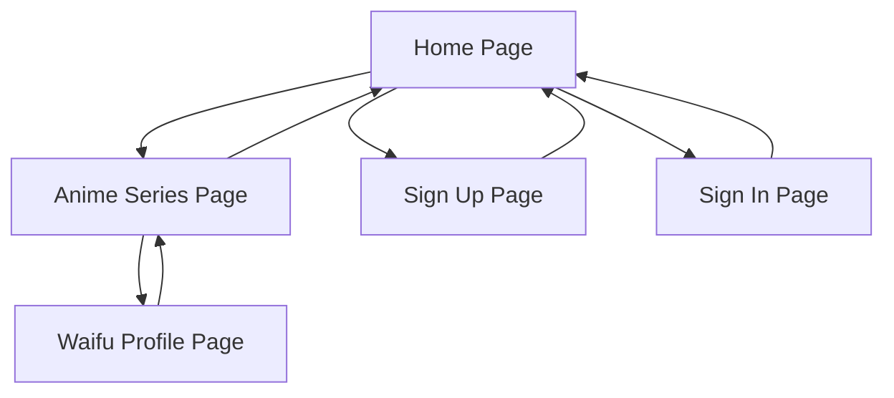

## 1. Product Overview
My Bini is an anime waifu gallery website that allows users to browse and discover anime characters organized by their respective series. Users can explore different anime series, view character profiles, and enjoy high-quality images of their favorite waifus.

The platform serves anime enthusiasts who want to explore character collections from various anime series in an organized, visually appealing gallery format with detailed character information and image portfolios.

## 2. Core Features

### 2.1 User Roles
| Role | Registration Method | Core Permissions |
|------|---------------------|------------------|
| Guest User | No registration required | Browse anime series, view waifu profiles and images |
| Registered User | Email registration via Firebase | All guest permissions + save favorites, personal collections |

### 2.2 Feature Module
Our anime waifu gallery consists of the following main pages:
1. **Home page**: Anime series grid/list with search and filtering options.
2. **Anime series page**: Waifu character grid for selected anime series.
3. **Waifu profile page**: Character information portfolio with image gallery.
4. **Authentication pages**: Sign up and sign in forms with Firebase integration.

### 2.3 Page Details
| Page Name | Module Name | Feature description |
|-----------|-------------|---------------------|
| Home page | Anime Series Grid | Display anime series in card/grid layout with cover images and series names. |
| Home page | Search Bar | Allow users to search anime series by name with real-time filtering. |
| Home page | Navigation | Header with logo, search, and user account access. |
| Anime Series page | Waifu Grid | Display all waifu characters from selected anime in responsive grid layout. |
| Anime Series page | Series Header | Show anime title, cover image, and brief description. |
| Anime Series page | Filter Options | Allow filtering waifus by characteristics (hair color, personality, etc.). |
| Waifu Profile page | Character Info | Display character name, age, height, personality traits, and backstory. |
| Waifu Profile page | Image Gallery | Show multiple high-quality images in masonry or carousel layout. |
| Waifu Profile page | Navigation | Breadcrumb navigation back to anime series and home. |
| Sign Up page | Registration Form | Email/password registration with Firebase authentication. |
| Sign In page | Login Form | Email/password login with password reset option. |

## 3. Core Process
**Guest User Flow:**
1. User lands on home page and browses available anime series
2. User clicks on an anime series to view its waifu characters
3. User clicks on a waifu to view detailed profile and image gallery
4. User can navigate back to series or home at any time

**Registered User Flow:**
1. User signs up/logs in via Firebase authentication
2. User can browse anime series and waifu profiles same as guest
3. User can save favorite waifus to personal collection (future enhancement)

## 4. User Interface Design

### 4.1 Design Style
- **Primary Colors**: Deep purple (#6B46C1) and pink (#EC4899) for anime aesthetic
- **Secondary Colors**: Dark gray (#1F2937) backgrounds with white/light text
- **Button Style**: Rounded corners with gradient effects, hover animations
- **Font**: Modern sans-serif (Inter or similar) with Japanese-inspired accents
- **Layout Style**: Card-based grid layouts with smooth transitions
- **Icons**: Anime-style emoji and custom SVG icons for characters/series

### 4.2 Page Design Overview
| Page Name | Module Name | UI Elements |
|-----------|-------------|-------------|
| Home page | Anime Series Grid | Responsive grid (3-4 columns desktop, 2 tablet, 1 mobile), card hover effects with zoom on cover images, gradient overlays for text readability. |
| Anime Series page | Waifu Grid | Masonry-style layout for character cards, smooth fade-in animations, character portraits with name overlays. |
| Waifu Profile page | Character Info | Clean portfolio layout with left-aligned info panel, right-side image gallery, accordion-style expandable sections. |
| Waifu Profile page | Image Gallery | Lightbox modal for full-size images, thumbnail grid below main image, Cloudinary optimization for fast loading. |

### 4.3 Responsiveness
Desktop-first design approach with mobile adaptation. Touch interaction optimization for image gallery swiping and card selections on mobile devices.

### 4.4 Image Handling
- Cloudinary integration for automatic image optimization and responsive delivery
- Lazy loading for grid images to improve initial page load performance
- Multiple image sizes served based on device screen size and resolution