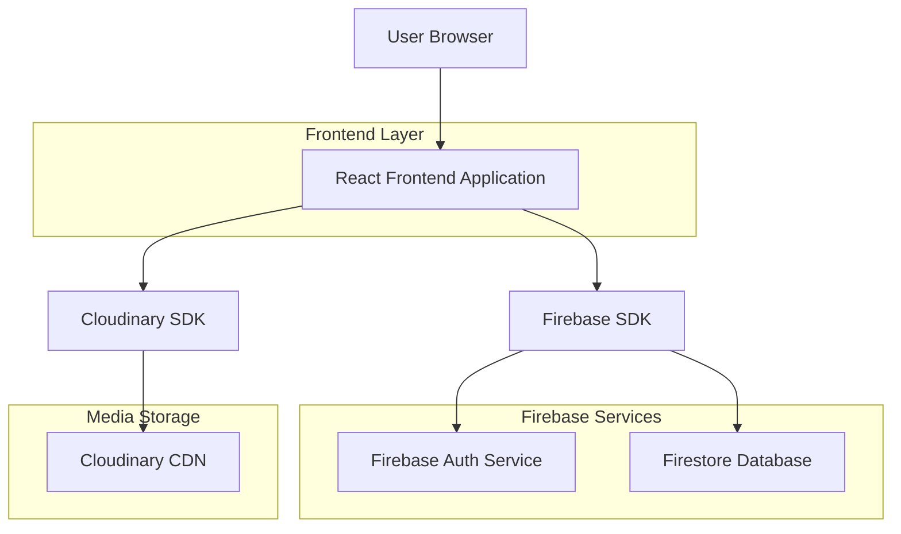
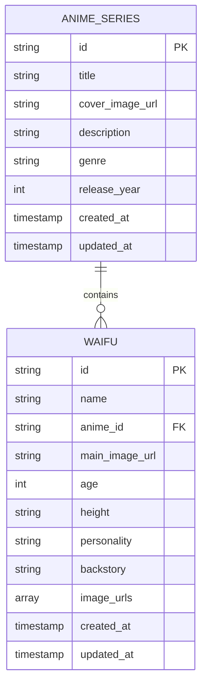

## 1. Architecture design



## 2. Technology Description
- Frontend: React@18 + tailwindcss@3 + vite
- Initialization Tool: vite-init
- Backend: Firebase (Authentication + Firestore)
- Media Storage: Cloudinary
- State Management: React Context API + useState/useEffect
- Routing: React Router v6

## 3. Route definitions
| Route | Purpose |
|-------|---------|
| / | Home page, displays anime series grid with search functionality |
| /anime/:animeId | Anime series page, shows waifu characters for specific anime |
| /waifu/:waifuId | Waifu profile page, displays character info and image gallery |
| /signup | Sign up page for new user registration |
| /login | Login page for existing users |
| /profile | User profile page (future enhancement) |

## 4. API definitions

### 4.1 Firebase Authentication APIs

**User Registration**
```
firebase.auth().createUserWithEmailAndPassword(email, password)
```

**User Login**
```
firebase.auth().signInWithEmailAndPassword(email, password)
```

**User Logout**
```
firebase.auth().signOut()
```

### 4.2 Firestore Database Operations

**Fetch All Anime Series**
```javascript
const getAnimeSeries = async () => {
  const querySnapshot = await db.collection('anime_series').get();
  return querySnapshot.docs.map(doc => ({ id: doc.id, ...doc.data() }));
};
```

**Fetch Waifus by Anime ID**
```javascript
const getWaifusByAnime = async (animeId) => {
  const querySnapshot = await db.collection('waifus')
    .where('anime_id', '==', animeId)
    .get();
  return querySnapshot.docs.map(doc => ({ id: doc.id, ...doc.data() }));
};
```

**Fetch Waifu Details**
```javascript
const getWaifuDetails = async (waifuId) => {
  const doc = await db.collection('waifus').doc(waifuId).get();
  return doc.exists ? { id: doc.id, ...doc.data() } : null;
};
```

### 4.3 Cloudinary Image Operations

**Optimized Image URL Generation**
```javascript
const getOptimizedImageUrl = (publicId, options = {}) => {
  const defaults = {
    width: 400,
    height: 600,
    crop: 'fill',
    quality: 'auto',
    fetch_format: 'auto'
  };
  return cloudinary.url(publicId, { ...defaults, ...options });
};
```

## 5. Data model

### 5.1 Data model definition


### 5.2 Data Definition Language

**Anime Series Collection Structure**
```javascript
// Firestore Collection: anime_series
{
  id: "auto-generated",
  title: "Attack on Titan",
  cover_image_url: "cloudinary-url",
  description: "Humanity fights for survival against giant humanoid Titans",
  genre: "Action, Dark Fantasy",
  release_year: 2013,
  created_at: timestamp,
  updated_at: timestamp
}
```

**Waifus Collection Structure**
```javascript
// Firestore Collection: waifus
{
  id: "auto-generated",
  name: "Mikasa Ackerman",
  anime_id: "anime-series-id",
  main_image_url: "cloudinary-main-image-url",
  age: 19,
  height: "170cm",
  personality: "Stoic, loyal, protective",
  backstory: "Last surviving member of the Ackerman clan...",
  image_urls: [
    "cloudinary-url-1",
    "cloudinary-url-2",
    "cloudinary-url-3"
  ],
  created_at: timestamp,
  updated_at: timestamp
}
```

## 6. Component Architecture

### 6.1 Core React Components
- `App.jsx` - Main application component with routing
- `components/Layout/Header.jsx` - Navigation header
- `components/Anime/AnimeSeriesGrid.jsx` - Anime series display
- `components/Anime/AnimeSeriesCard.jsx` - Individual anime card
- `components/Waifu/WaifuGrid.jsx` - Waifu character grid
- `components/Waifu/WaifuCard.jsx` - Individual waifu card
- `components/Waifu/WaifuProfile.jsx` - Detailed waifu profile
- `components/Auth/SignUp.jsx` - User registration
- `components/Auth/Login.jsx` - User authentication
- `components/Common/ImageGallery.jsx` - Cloudinary image display

### 6.2 Custom Hooks
- `useAuth.js` - Firebase authentication state management
- `useFirestore.js` - Firestore data fetching utilities
- `useCloudinary.js` - Image optimization helpers

## 7. Security Considerations
- Firebase Security Rules for Firestore access control
- Cloudinary URL signing for secure image access
- Environment variables for API keys and configuration
- Input validation for search and filter functionality