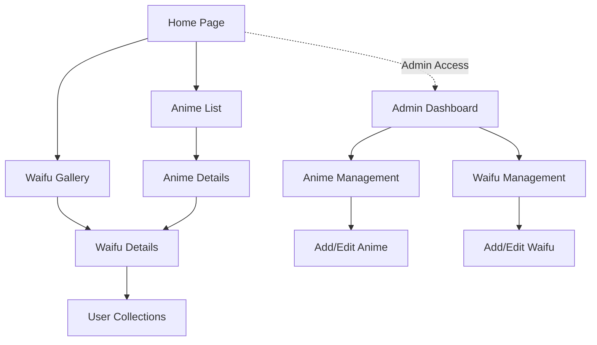

## 1. Product Overview
My Bini is a platform for anime enthusiasts to discover, collect, and share information about their favorite anime series and waifu characters. Users can browse anime content, view detailed waifu profiles, and manage their personal collections.

The platform serves anime fans worldwide by providing a comprehensive database of anime series and characters, with social features for community engagement and content management tools for administrators.

## 2. Core Features

### 2.1 User Roles
| Role | Registration Method | Core Permissions |
|------|---------------------|------------------|
| Regular User | Email/Social login | Browse anime/waifu content, create collections, rate content |
| Admin | Admin-only registration | Full content management, user management, system configuration |

### 2.2 Feature Module
Our anime platform consists of the following main pages:
1. **Home page**: Featured anime, trending waifu, navigation menu, search functionality.
2. **Anime List page**: Browse all anime series, filtering options, pagination.
3. **Anime Details page**: Series information, episode list, character gallery, ratings.
4. **Waifu Gallery page**: Character showcase, filtering by series, popularity rankings.
5. **Waifu Details page**: Character profile, voice actor info, appearance episodes.
6. **User Collections page**: Personal favorites, watch history, ratings.
7. **Admin Dashboard page**: Content management, user analytics, system settings.
8. **Admin Anime Management page**: Add/edit/delete anime series with image uploads.
9. **Admin Waifu Management page**: Add/edit/delete character profiles with image uploads.

### 2.3 Page Details
| Page Name | Module Name | Feature description |
|-----------|-------------|---------------------|
| Home page | Hero section | Display featured anime carousel with auto-rotation every 5 seconds. |
| Home page | Trending section | Show top 6 trending waifu characters based on user interactions. |
| Home page | Navigation | Sticky header with main menu, search bar, and user profile dropdown. |
| Anime List page | Filter sidebar | Filter by genre, year, status (ongoing/completed), and rating. |
| Anime List page | Anime grid | Card-based layout showing anime cover, title, and basic info. |
| Anime Details page | Series info | Display title, synopsis, genre, studio, episode count, and rating. |
| Anime Details page | Character gallery | Grid of waifu characters with hover effects and quick-view modal. |
| Waifu Gallery page | Character grid | Masonry layout with character images, names, and series origin. |
| Waifu Gallery page | Sort options | Sort by popularity, newest, alphabetical, or user ratings. |
| Waifu Details page | Profile section | Character image, name, series, voice actor, and detailed description. |
| User Collections page | Favorites tab | User's favorited anime and waifu with quick access buttons. |
| User Collections page | Watch history | Track viewing progress with continue watching functionality. |
| Admin Dashboard page | Analytics overview | Display user statistics, content metrics, and engagement data. |
| Admin Dashboard page | Quick actions | Direct links to content management and user administration. |
| Admin Anime Management page | Add anime form | Multi-step form with title, description, genre, studio, and image upload. |
| Admin Anime Management page | Edit anime | Modify existing series information with real-time preview. |
| Admin Anime Management page | Delete confirmation | Soft delete with confirmation dialog and undo option. |
| Admin Waifu Management page | Add waifu form | Character creation with name, description, voice actor, and image upload. |
| Admin Waifu Management page | Series association | Link characters to their respective anime series with autocomplete. |
| Admin Waifu Management page | Batch operations | Upload multiple characters via CSV import functionality. |

## 3. Core Process
### Regular User Flow
Users can browse the homepage to discover featured content, navigate to anime listings to explore series, view detailed information about specific anime, browse character galleries, and manage their personal collections with ratings and favorites.

### Admin User Flow
Admins access the protected dashboard to view analytics, manage anime content through add/edit/delete operations with image uploads, manage waifu character profiles with series associations, and monitor user activity and system health.

## 4. User Interface Design

### 4.1 Design Style
- **Primary Colors**: Deep purple (#6B46C1) for primary actions, pink (#EC4899) for accents
- **Secondary Colors**: Dark gray (#1F2937) for backgrounds, light gray (#F3F4F6) for cards
- **Button Style**: Rounded corners (8px radius), gradient backgrounds on hover
- **Typography**: Inter font family, 16px base size, 1.5 line height
- **Icons**: Line-based icons from Heroicons, consistent 24px size
- **Layout**: Card-based design with subtle shadows, 12px spacing system

### 4.2 Page Design Overview
| Page Name | Module Name | UI Elements |
|-----------|-------------|-------------|
| Home page | Hero section | Full-width carousel with 3 featured anime, auto-play, navigation dots. |
| Anime List page | Filter sidebar | Collapsible accordion filters, checkbox lists, range sliders for ratings. |
| Admin Dashboard page | Analytics cards | Grid of metric cards with trend indicators and sparkline charts. |
| Admin Anime Management page | Form layout | Two-column layout with left side for text inputs, right side for image preview. |
| Admin Waifu Management page | Image upload | Drag-and-drop zone with preview, multiple format support, size validation. |

### 4.3 Responsiveness
Desktop-first design approach with responsive breakpoints at 1024px (tablet) and 768px (mobile). Touch interactions optimized for mobile with larger tap targets and swipe gestures for carousels.

### 4.4 Image Upload Guidelines
- **Supported Formats**: JPEG, PNG, WebP, maximum 5MB per image
- **Resolution**: Minimum 400x600px for anime covers, 300x300px for waifu portraits
- **Processing**: Automatic compression and WebP conversion on upload
- **Storage**: Cloudinary CDN with automatic responsive image generation
- **Validation**: Client-side format/size check, server-side security scan