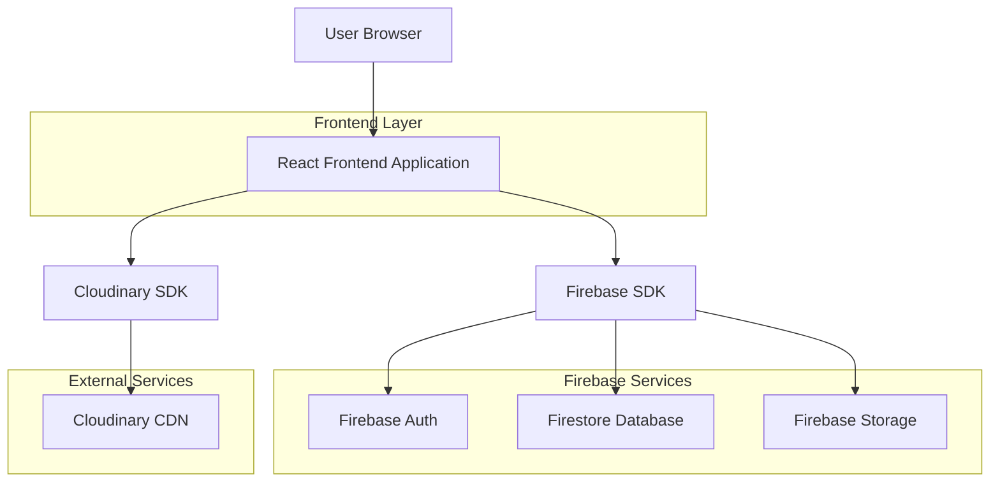
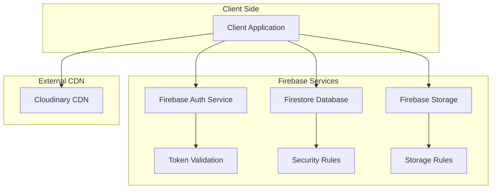
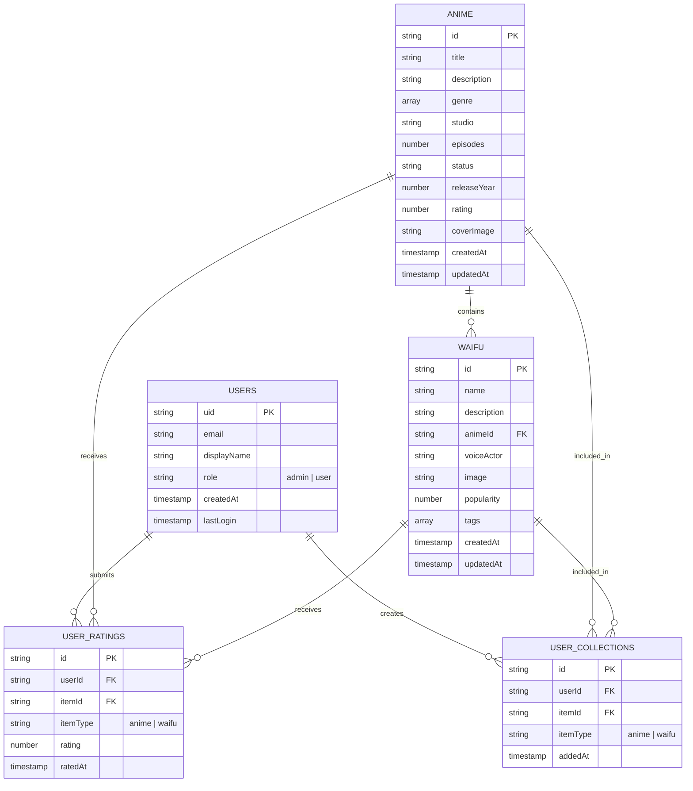

## 1. Architecture design



## 2. Technology Description
- **Frontend**: React@18 + tailwindcss@3 + vite
- **Initialization Tool**: vite-init
- **Backend**: Firebase (Auth, Firestore, Storage)
- **Image CDN**: Cloudinary
- **State Management**: React Context + useReducer
- **Routing**: React Router v6
- **UI Components**: HeadlessUI + Heroicons

## 3. Route definitions
| Route | Purpose |
|-------|---------|
| / | Home page with featured content and navigation |
| /anime | Browse all anime series with filtering options |
| /anime/:id | Detailed view of specific anime series |
| /waifu | Character gallery with sorting and filtering |
| /waifu/:id | Individual character profile page |
| /collections | User's personal favorites and watch history |
| /login | User authentication page |
| /register | New user registration page |
| /admin | Protected admin dashboard with analytics |
| /admin/anime | Anime content management interface |
| /admin/anime/new | Add new anime series form |
| /admin/anime/:id/edit | Edit existing anime series |
| /admin/waifu | Character content management interface |
| /admin/waifu/new | Add new character form |
| /admin/waifu/:id/edit | Edit existing character profile |

## 4. API definitions

### 4.1 Firebase Authentication APIs

**User Registration**
```javascript
// Firebase Auth SDK
const createUserWithEmailAndPassword = async (email, password, displayName) => {
  // Creates new user account
  // Returns user object with uid, email, displayName
}
```

**User Login**
```javascript
// Firebase Auth SDK
const signInWithEmailAndPassword = async (email, password) => {
  // Authenticates existing user
  // Returns user object and access token
}
```

### 4.2 Firestore Database Operations

**Anime Collection Structure**
```javascript
// Collection: anime
{
  id: string,
  title: string,
  description: string,
  genre: string[],
  studio: string,
  episodes: number,
  status: 'ongoing' | 'completed',
  releaseYear: number,
  rating: number,
  coverImage: string, // Cloudinary URL
  createdAt: timestamp,
  updatedAt: timestamp
}
```

**Waifu Collection Structure**
```javascript
// Collection: waifu
{
  id: string,
  name: string,
  description: string,
  animeId: string, // Reference to anime collection
  voiceActor: string,
  image: string, // Cloudinary URL
  popularity: number,
  tags: string[],
  createdAt: timestamp,
  updatedAt: timestamp
}
```

### 4.3 Cloudinary Image Upload

**Upload Configuration**
```javascript
// Cloudinary upload preset
const uploadOptions = {
  cloud_name: 'your-cloud-name',
  upload_preset: 'mybini-images',
  folder: 'anime_covers', // or 'waifu_profiles'
  allowed_formats: ['jpg', 'png', 'webp'],
  max_file_size: 5000000, // 5MB
  transformation: [
    { width: 800, height: 1200, crop: 'fill' }, // Anime covers
    { width: 400, height: 400, crop: 'fill' } // Waifu profiles
  ]
}
```

## 5. Server architecture diagram



## 6. Data model

### 6.1 Data model definition



### 6.2 Firestore Security Rules

**Admin Role Verification**
```javascript
// Firestore security rules
rules_version = '2';
service cloud.firestore {
  match /databases/{database}/documents {
    // Helper functions
    function isAuthenticated() {
      return request.auth != null;
    }
    
    function isAdmin() {
      return isAuthenticated() && request.auth.token.role == 'admin';
    }
    
    // Admin-only collections
    match /anime/{animeId} {
      allow read: if true;
      allow write: if isAdmin();
    }
    
    match /waifu/{waifuId} {
      allow read: if true;
      allow write: if isAdmin();
    }
    
    // User collections
    match /users/{userId} {
      allow read: if isAuthenticated() && request.auth.uid == userId;
      allow write: if isAuthenticated() && request.auth.uid == userId;
    }
    
    match /user_collections/{collectionId} {
      allow read: if isAuthenticated() && request.auth.uid == resource.data.userId;
      allow write: if isAuthenticated() && request.auth.uid == request.resource.data.userId;
    }
    
    match /user_ratings/{ratingId} {
      allow read: if true;
      allow write: if isAuthenticated() && request.auth.uid == request.resource.data.userId;
    }
  }
}
```

### 6.3 Firebase Authentication Claims

**Admin Role Assignment**
```javascript
// Firebase Admin SDK - Server-side only
const setAdminRole = async (uid) => {
  await admin.auth().setCustomUserClaims(uid, { role: 'admin' });
};

// Client-side role check
const isAdmin = async (user) => {
  const token = await user.getIdTokenResult();
  return token.claims.role === 'admin';
};
```

### 6.4 Cloudinary Integration

**Upload Configuration**
```javascript
// Cloudinary upload widget configuration
const uploadWidget = cloudinary.createUploadWidget({
  cloudName: 'mybini-cdn',
  uploadPreset: 'anime_content',
  sources: ['local', 'url', 'camera'],
  multiple: false,
  maxFileSize: 5000000,
  clientAllowedFormats: ['jpg', 'png', 'webp'],
  transformation: {
    quality: 'auto',
    fetch_format: 'auto',
    width: 'auto',
    crop: 'limit'
  }
}, (error, result) => {
  if (!error && result && result.event === "success") {
    // Handle successful upload
    const imageUrl = result.info.secure_url;
    // Save to Firestore
  }
});
```