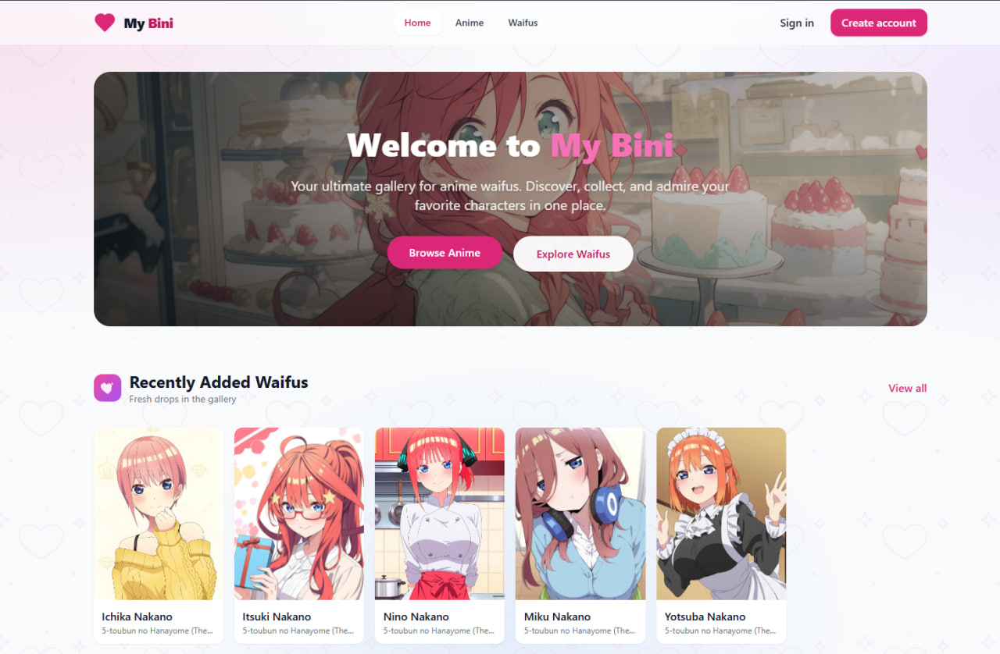
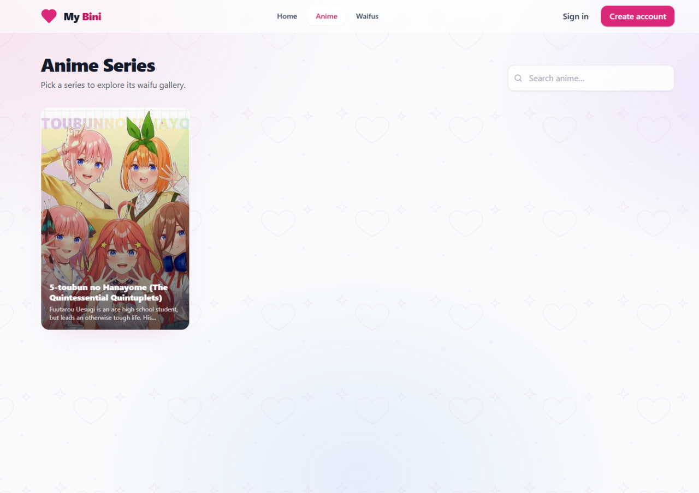
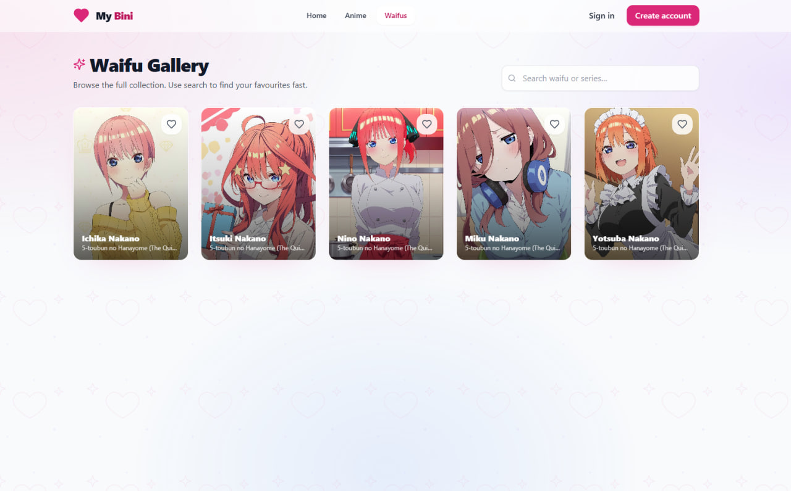
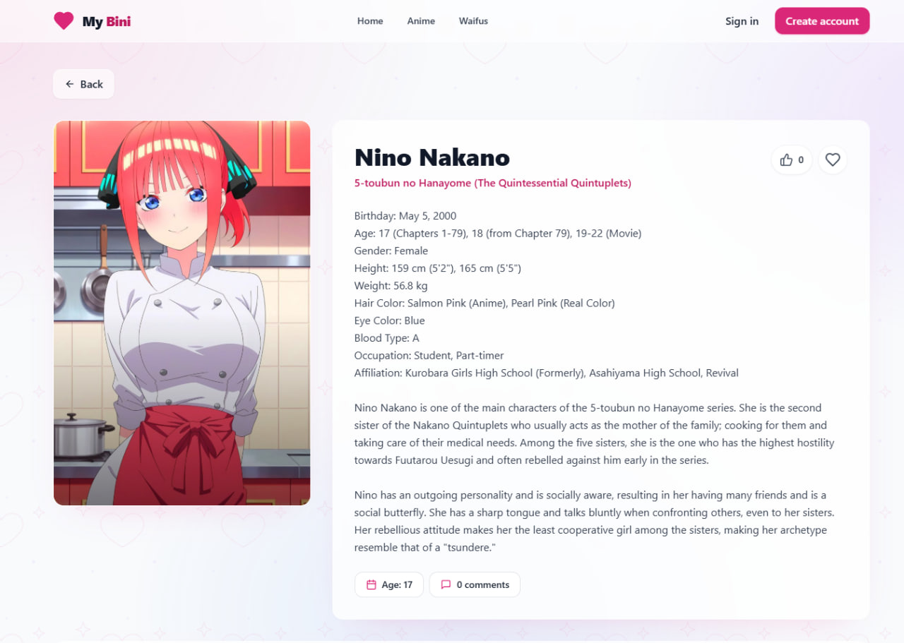
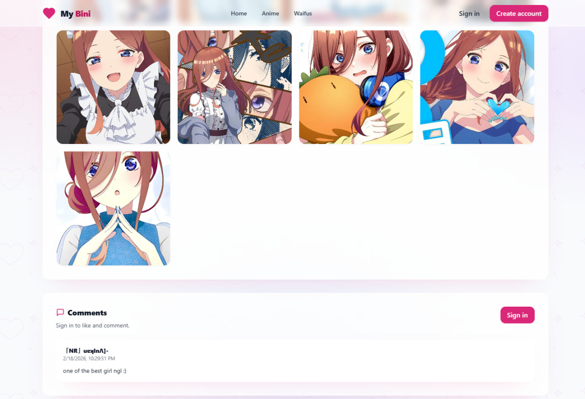

# MyBiniGalLery

My Bini is a chill little gallery for anime series + waifus.

You show up, browse waifus, save your favourites, and leave a comment when you find the one that lives rent-free in your head. No complicated stuff, just a clean gallery you can scroll for fun.

## What you can do here

- Browse anime series, then jump into their waifu collections
- Open a waifu page with images + details
- Save favourites so you can come back later
- Drop likes and comments (without showing your email in public)

## Quick tour (so you don’t get lost)

- Want to browse by series? Head to **Anime**
- Want the full buffet? Go to **Waifus**
- Found a waifu you like? Hit the **heart** to favourite
- Want to join the chat? Open a waifu and post a comment

## Screenshots

Here’s what the app looks like when you’re actually using it.

### 1) Homepage (the “start scrolling” vibe)

Landing page with quick paths into browsing, plus the “recently added” stuff so you can instantly click something cool.



### 2) Anime list (pick a series first)

Browse anime series. Tap one to jump into a filtered waifu gallery for that show.



### 3) Waifu gallery (the main buffet)

Grid view of waifus. This is where you do most of your browsing and open a waifu you want to see up close.



### 4) Waifu detail (photos + info)

Individual waifu page with the main image, details, gallery, and the social bits (likes/comments).



### 5) Comments (say something nice)

Comment thread on a waifu page. You can post replies and see what other people said without exposing emails publicly.



## Admin corner (for whoever runs the collection)

- There’s an admin area to create/edit anime and waifus
- You can upload cover images + waifu images + galleries
- Admin access is role-based (so random users don’t get the keys)

---

<details>
<summary><strong>Developer setup (click to expand)</strong></summary>

## Tech stack

- React + TypeScript + Vite
- Tailwind CSS
- Firebase (Auth, Firestore, Analytics)
- Cloudinary (image uploads)
- Zustand (state)
- Framer Motion (animations)

## Getting started

### Prerequisites

- Node.js 18+ (recommended for Vite 6)
- A Firebase project (Auth + Firestore)
- A Cloudinary account (upload preset)

### Install

Using pnpm:

```bash
pnpm install
```

Or npm:

```bash
npm install
```

### Environment variables

Create a `.env` file at the project root and set:

```bash
VITE_FIREBASE_API_KEY=...
VITE_FIREBASE_AUTH_DOMAIN=...
VITE_FIREBASE_PROJECT_ID=...
VITE_FIREBASE_STORAGE_BUCKET=...
VITE_FIREBASE_MESSAGING_SENDER_ID=...
VITE_FIREBASE_APP_ID=...
VITE_FIREBASE_MEASUREMENT_ID=...

VITE_CLOUDINARY_CLOUD_NAME=...
VITE_CLOUDINARY_UPLOAD_PRESET=...
```

These keys are used in:

- Firebase config: [firebase.ts](file:///g:/DEVELOPMENT-TRAE/MyBiniGal/src/config/firebase.ts)
- Cloudinary upload helper: [cloudinary.ts](file:///g:/DEVELOPMENT-TRAE/MyBiniGal/src/lib/cloudinary.ts)

### Run the app

```bash
pnpm dev
```

Open the URL shown in the terminal (typically `http://localhost:5173`).

## Scripts

- `pnpm dev` — start dev server
- `pnpm build` — typecheck + production build
- `pnpm preview` — preview production build locally
- `pnpm lint` — run ESLint
- `pnpm check` — typecheck only

## Firebase setup notes

### Authentication

- Enable Email/Password sign-in
- Enable Google sign-in

### Firestore collections used

- `users/{uid}`: stores user profile data and `role`
- `anime/{id}`: anime series list
- `waifus/{id}`: waifu entries linked to anime via `animeId`

The user role is read from Firestore and defaults to `user` if missing:

- Auth bootstrap: [App.tsx](file:///g:/DEVELOPMENT-TRAE/MyBiniGal/src/App.tsx)
- Admin guard: [AuthGuard.tsx](file:///g:/DEVELOPMENT-TRAE/MyBiniGal/src/components/AuthGuard.tsx)

### Making a user an admin

In Firestore, set `users/{uid}.role` to `admin`. Admin routes live under `/admin` (see [AppRoutes.tsx](file:///g:/DEVELOPMENT-TRAE/MyBiniGal/src/AppRoutes.tsx)).

## Cloudinary notes

This app uploads directly from the browser using an unsigned upload preset. Treat the preset as a public capability and configure Cloudinary restrictions appropriately (allowed formats, max size, folder, etc.).

## Project structure

```
src/
  components/   shared UI + layouts + guards
  config/       firebase setup
  hooks/        reusable hooks
  lib/          helpers (cloudinary, utils)
  pages/        routes (public + admin)
  store/        zustand stores
  types/        shared TypeScript types
```

</details>
